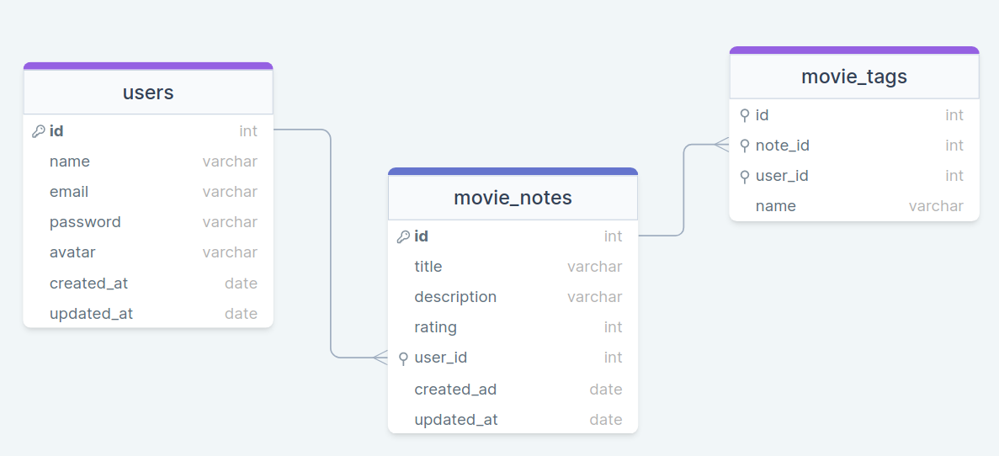

  

   
   

  

    <a href="#-rocketmovies">Rocketmovies</a>&nbsp;&nbsp;&nbsp;|&nbsp;&nbsp;&nbsp;
    <a href="#-banco">Banco de dados</a>&nbsp;&nbsp;&nbsp;|&nbsp;&nbsp;&nbsp;
    <a href="#-estrutura">Estrutura</a>&nbsp;&nbsp;&nbsp;|&nbsp;&nbsp;&nbsp;
    <a href="#-contato">Contato</a>
  

  
  

## Rocketmovies
O Rocketmovies é uma aplicação de filmes, onde o usuário cadastra um filme, preenche com algumas informações (nome, descrição, nota) e cria tags relacionadas a ele.

## Banco de dados
Nessa aplicação foi utilizado banco de dados relacional (SQL). Para ambiente de desenvolvimento seguiremos com o SQLite pela facilidade do ambiente.

### Estrutura Bando de dados

## Contato
Se você tiver alguma dúvida ou quiser entrar em contato, você pode me enviar uma mensagem pelo
[LinkedIn](https://www.linkedin.com/in/joao-sillva/).

(<a href="#readme-top">voltar ao topo</a>)
